# Bikesharing

## Analysis Overview
The purpose of this analysis is to utilize Tableau to assist an emerging bike sharing company, and show how the visualization tool can be used to transform data into an engaging story for any audience. We wanted to see if it is worth it for investors to invest in the emerging start up based in Des Moines Iowa.

## Resources 
- **Data Source:** 201908-citibike-tripdata.csv, new201908-citibike-tripdata.csv, [Citibike System Data Page](https://www.citibikenyc.com/system-data)
- **Software:** Tableau Public, Jupyter Notebook

## Objectives
- Importing our data into Tableau.
- Creating and styling worksheets, dashboards, and stories in Tableau Public.
- Use Tableau worksheets to display data in an interesting and captivating way that is easily translated to clients.
- Portray data accurately using Tableau stories & dashboards.

## Summary
### Importing data into Tableau Public

Tableau is one of the most popular data visualization tools today. With Tableau we can easily translate and visualize data for clients that we are doing data analysis for.  

There are two primary ways that Tableau connects to the data we provide: through live data or extract data. Both have their benefits and uses.

**Live data** is primarily databases such as MySQL and Microsoft SQL Server. Live data is just what it sounds like: live data. This type of data is updated every time we view the dashboard, since it's possible that the data has changed in our database.

**Extract data** is primarily when we use files such as CSV, TXT, or PDF. These files remain unchanged unless we pull a new extract of the data. For example, if we update the file, we would have to update it in Tableau as well.

For our analysis, we imported the CSV file containing the citibike data, that particular CSV file contained all the data we needed. Therefore, we'll technically be working with **extract data** for this analysis.

## Using Jupyter notebook to Convert Data

To properly display data in our Tableau Public environment sometimes we need to convert data that will not properly translate to the realm of visualization. For this process we use Jupyter Notebook to convert the necessary data in our CSV file. After this step is completed, we can then import the data into Tableau Public and continue our analysis.

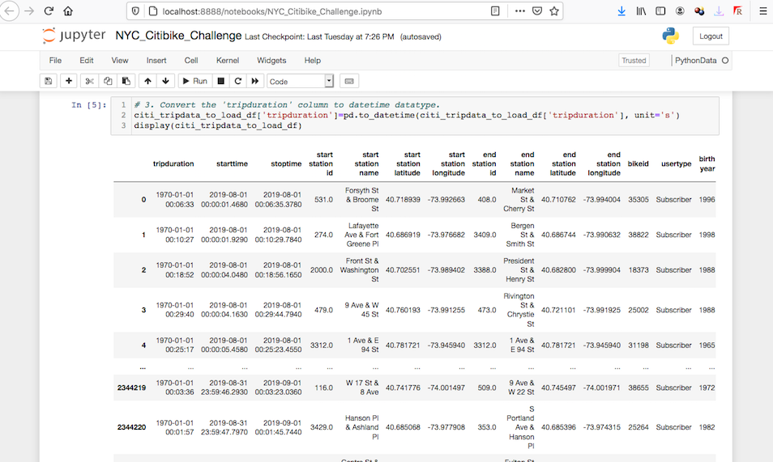

## Creating Calculated Fields

A calculated field essentially allows us to write code to customize our data.

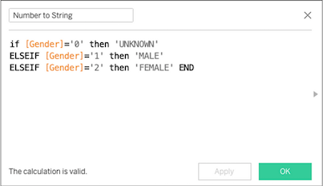

This is another example in the realm of converting data in order for it to be properly displayed in our Tableau Public environment except we are executing it within Tableau itself. After we convert the data via creating a calculated field we can then properly view the visualization in our worksheet.

## Creating and styling worksheets, dashboards, and stories in Tableau

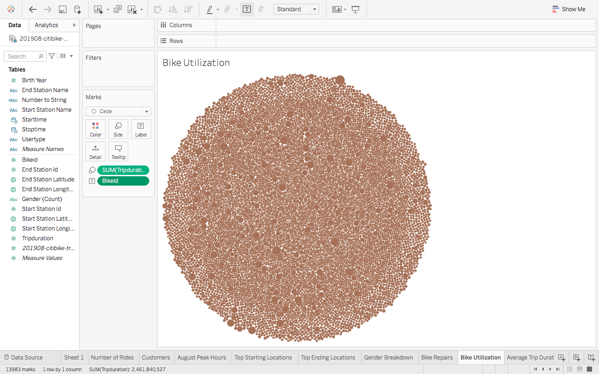

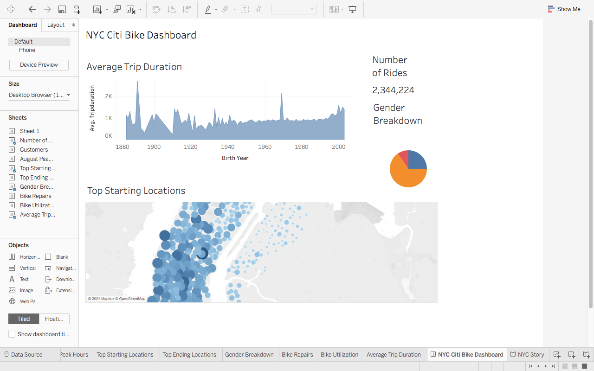

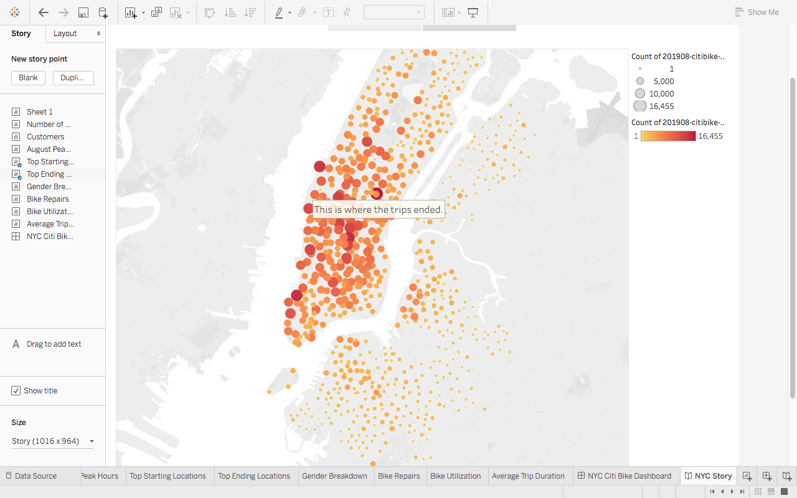

## Results

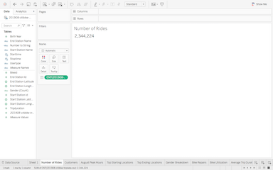

Number of rides taken for the period of analysis

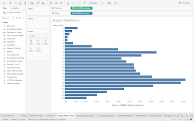

Peak hours for rides during the month of August

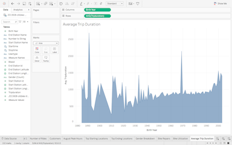

The average time of a trip.

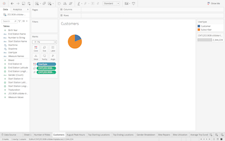

Customers vs. subscribers.

A visualization depicting the starting loctaions of rides.

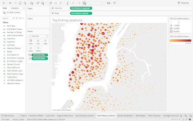

A visualization depicting the ending location of rides.

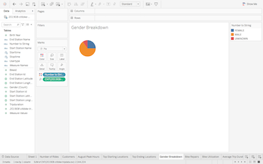

A visualization depicting the breakdown of the different genders using the bike sharing service.

## Summary

Through our analysis we see that on average Male customers & subscribers take more short trips than Female customers & subscribers. We also see that the sex that is most likely to rent a bike and use it during the daytime hours is Male. This is adequate information that can be used by the emerging bike sharing start-up and it can definitely be applied to the potential customers and subscribers in Iowa. Two additional visualizations that we would conduct with the data that would also be beneficial to investors and owners of the start-up would be to visualize the data that shows how the habits of bike renters change with te seasons as well as with weather conditions. Another additional visualization that would be helpful would be to see if there is a correlation between the amount of repairs that need to be performed on bikes and the location in which they originate from and end at.

